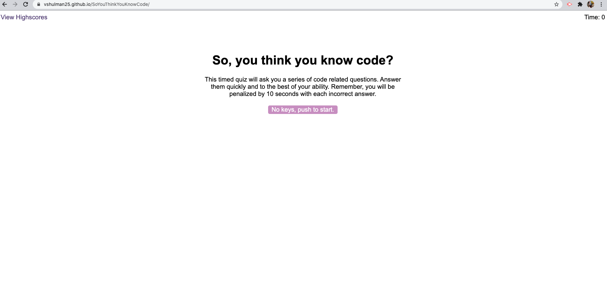
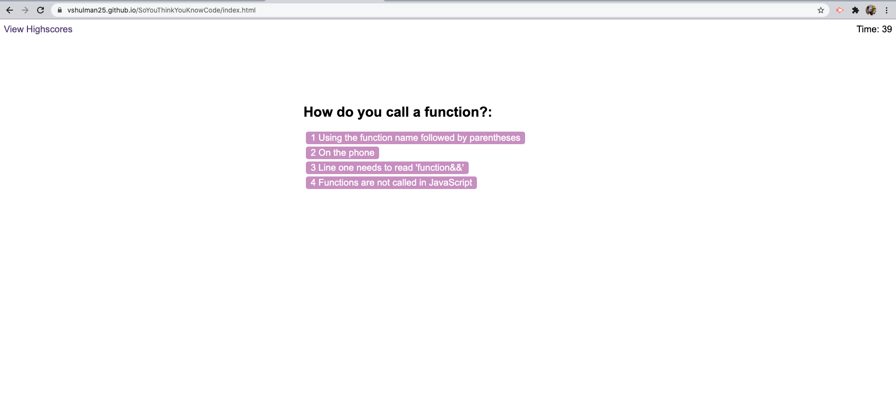
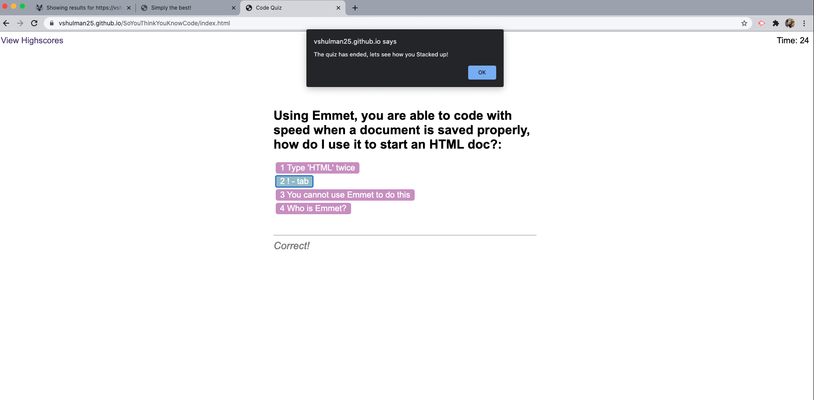
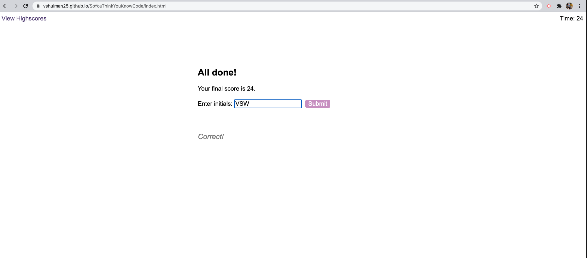
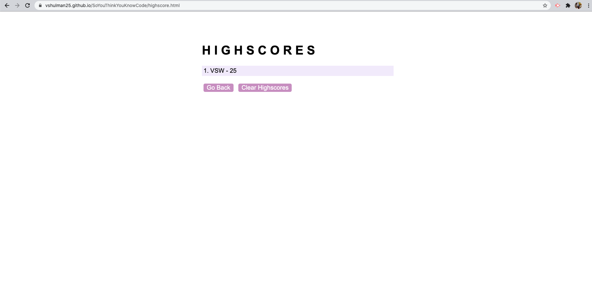

# 04 Web APIs: Code Quiz 

---

## Description 

Timed code quiz that allows user to view multiple choice questions and select their answer. It will run in the browser with dynamically updated HTML & CSS that runs with JavaScript. 

---

## Development Process 

This was not an easy assignment, the process of creating a functioning quiz is tough enough - adding in the timer and high score storage added to the difficulty. I created a list, work my way through some key elements of this timed quiz and tried my best to leave detailed notes throughout my files. I left some of the list below to display my thought process and with hopes that it may help other who attempt to create a code quiz.

 - [ ] Start page 
     - [ ] Start button - triggers timer
     - [ ] View highscore button - additional files with high score functions, allows user to save
- [ ] Timer 
    - [ ] Must keep track of timed quiz, 60 seconds
    - [ ] Time must be deducted (--) with wrong answer
    - [ ] Alert when time is out - end quiz
- [ ] Questions 
    - [ ] 5-6 questions about coding
    - [ ] 4 choice, 1 answer 
    - [ ] Write ea as an array within questions variable
    - [ ] A function will check if answer selected was right or wrong (t/f)
- [ ] Final score 
    - [ ] Score depends on time
    - [ ] User will input initials and time will be saved with them 
    - [ ] Save in local store - JSON    

---

## Installation 

Use preferred code reader and browser to view HTML, JS CSS & README files.

--- 

## Preview 

---

## Live Link 

https://vshulman25.github.io/SoYouThinkYouKnowCode/

---

## Credits

Developer - Victoria Shulman 